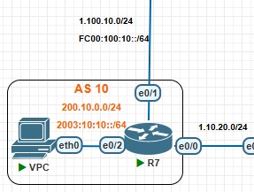
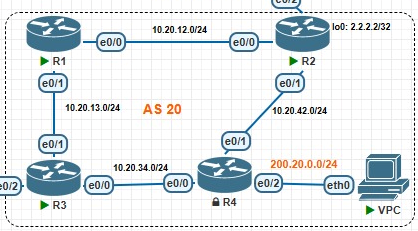
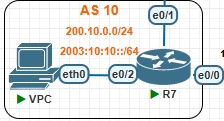

# Projeto BGP - Configuração Avançada de Roteamento Inter-AS

## 📋 Sobre o Projeto

Este projeto implementa um cenário completo de roteamento BGP baseado no exercício do **Instituto Federal da Paraíba (IFPB)**, desenvolvido pelo **Professor Pedro Filho** em 2025. O cenário abrange configurações avançadas de BGP incluindo iBGP, eBGP, MP-BGP, Route Reflector, TTL Security e engenharia de tráfego complexa.

### 🎯 Objetivos Específicos Implementados

- ✅ **iBGP** com Route Reflector para escalabilidade
- ✅ **eBGP** entre múltiplos AS com políticas diferenciadas  
- ✅ **MP-BGP** para suporte dual-stack IPv4/IPv6
- ✅ **Conexão com IX** (PIX BR-JP) com VLANs específicas
- ✅ **TTL Security** em sessões críticas
- ✅ **Filtros de rotas** para controle de trânsito
- ✅ **Engenharia de Tráfego** bidirecional
- ✅ **Suporte a AS de Trânsito** com políticas restritivas

## 🏗️ Arquitetura Detalhada da Rede

### Topologia Implementada


### Autonomous Systems Configurados
#### AS 10 (R7) - Cliente com Redundância


- **Função**: Cliente com conectividade dupla
- **Conectividade Primária**: AS 100 (Internet) via 1.100.10.0/24
- **Conectividade Backup**: AS 20 (Trânsito) via 1.10.20.0/24
- **Redes Anunciadas**: 
  - IPv4: 200.10.0.0/24
  - IPv6: 2003:10:10::/64

#### AS 20 (R1, R2, R3, R4) - Grande Provedor

- **Função**: ISP com múltiplos clientes e acordos de peering
- **R1**: Router cliente interno (10.20.12.1, 10.20.13.1)
- **R2**: Router de borda com filtros avançados (10.20.12.2, 10.20.42.2)
- **R3**: Route Reflector principal (10.20.34.3, 10.20.13.3, 1.10.20.3)
- **R4**: Router cliente com conectividade externa (10.20.34.4, 10.20.42.4, 200.20.0.1)

## 📊 Esquema de Endereçamento Detalhado

### IPv4 - Implementação Real
```
Enlaces Inter-AS:
├── AS 10 ↔ AS 20: 1.10.20.0/24
│   ├── R7: 1.10.20.7
│   └── R3: 1.10.20.3
├── AS 10 ↔ AS 100: 1.100.10.0/24  
│   ├── R7: 1.100.10.7
│   └── R8: 1.100.10.8
└── AS 20 ↔ PIX: Através de R2 (configuração não mostrada)

Enlaces Internos AS 20:
├── R1 ↔ R2: 10.20.12.0/24 (R1: .1, R2: .2)
├── R1 ↔ R3: 10.20.13.0/24 (R1: .1, R3: .3)
├── R3 ↔ R4: 10.20.34.0/24 (R3: .3, R4: .4)
└── R2 ↔ R4: 10.20.42.0/24 (R2: .2, R4: .4)

Redes de Clientes:
├── AS 10: 200.10.0.0/24 (Loopback R7: 200.10.0.7)
└── AS 20: 200.20.0.0/24 (Interface R4: 200.20.0.1)
```

### IPv6 - Implementação Real
```
Enlaces Inter-AS:
└── AS 10 ↔ AS 100: FC00:100:10::/64
    ├── R7: FC00:100:10::7
    └── R8: FC00:100:10::8

Redes Públicas:
└── AS 10: 2003:10:10::/64 (Loopback R7)
```

## ⚙️ Configurações Detalhadas Implementadas

### AS 10 - Router R7 (Configuração Completa)


```cisco
hostname R7

interface Loopback0
 ip address 200.10.0.7 255.255.255.0
 ipv6 address 2003:10:10::1/64

interface Ethernet0/0
 ip address 1.10.20.7 255.255.255.0

interface Ethernet0/1  
 ip address 1.100.10.7 255.255.255.0
 ipv6 address FC00:100:10::7/64

router bgp 10
 neighbor 1.10.20.3 remote-as 20
 neighbor 1.100.10.8 remote-as 100
 neighbor FC00:100:10::8 remote-as 100
 
 address-family ipv4
  network 200.10.0.0
  neighbor 1.10.20.3 activate
  neighbor 1.100.10.8 activate
  no neighbor FC00:100:10::8 activate
  
 address-family ipv6
  network 2003:10:10::/64
  neighbor 1.100.10.8 activate
  neighbor FC00:100:10::8 activate
```

**Características Implementadas:**
- ✅ MP-BGP dual-stack com AS 100
- ✅ eBGP backup com AS 20  
- ✅ Anúncio correto de prefixos públicos
- ✅ Separação de neighbors IPv4/IPv6

### AS 20

### AS 20 - Configuração do Route Reflector (R3)

```cisco
hostname R3

interface Ethernet0/0
 ip address 10.20.34.3 255.255.255.0

interface Ethernet0/1
 ip address 10.20.13.3 255.255.255.0

interface Ethernet0/2
 ip address 1.10.20.3 255.255.255.0

router bgp 20
 bgp cluster-id 2
 neighbor 1.10.20.7 remote-as 10
 neighbor 10.20.13.1 remote-as 20
 neighbor 10.20.34.4 remote-as 20
 
 address-family ipv4
  neighbor 1.10.20.7 activate
  neighbor 10.20.13.1 activate
  neighbor 10.20.13.1 route-reflector-client
  neighbor 10.20.13.1 next-hop-self
  neighbor 10.20.34.4 activate
  neighbor 10.20.34.4 route-reflector-client
  neighbor 10.20.34.4 next-hop-self
```

**Características do Route Reflector:**
- ✅ **Cluster-ID**: 2 (evita loops RR)
- ✅ **Clientes RR**: R1 (10.20.13.1) e R4 (10.20.34.4)
- ✅ **Next-hop-self**: Para clientes iBGP
- ✅ **eBGP**: Conexão com AS 10

### AS 20 - Configuração com Filtros (R2)

```cisco
! Análise da configuração R2 - Apenas fragmento disponível
ip prefix-list SEM-TRANS seq 10 permit 200.20.0.0/24

route-map FILTRO-AS100 permit 10
 match ip address prefix-list SEM-TRANS
 set as-path prepend 20 20

route-map FILTRO-AS30 permit 10
 match ip address prefix-list SEM-TRANS
 set as-path prepend 20 20 20

route-map PREF-AS10 permit 10
 set local-preference 1
```

**Políticas de Engenharia de Tráfego:**
- ✅ **Prefix-list SEM-TRANS**: Permite apenas 200.20.0.0/24
- ✅ **AS-Path Prepending**: 
  - Para AS 100: prepend "20 20" (menos preferível)
  - Para AS 30: prepend "20 20 20" (ainda menos preferível)
- ✅ **Local Preference**: Valor 1 para AS 10 (rota menos preferível internamente)

### AS 20 - Configuração Cliente/Servidor (R1 e R4)

#### Router R1 (Cliente Route Reflector)
```cisco
hostname R1

interface Ethernet0/0
 ip address 10.20.12.1 255.255.255.0

interface Ethernet0/1
 ip address 10.20.13.1 255.255.255.0

router bgp 20
 neighbor 10.20.12.2 remote-as 20
 neighbor 10.20.12.2 cluster-id 0.0.0.2
 neighbor 10.20.13.3 remote-as 20
```

#### Router R4 (Cliente Route Reflector + Gateway)
```cisco
hostname R4

interface Ethernet0/0
 ip address 10.20.34.4 255.255.255.0

interface Ethernet0/1
 ip address 10.20.42.4 255.255.255.0

interface Ethernet0/2
 ip address 200.20.0.1 255.255.255.0  ! Gateway do cliente

router bgp 20
 neighbor 10.20.34.3 remote-as 20
 neighbor 10.20.42.2 remote-as 20  
 neighbor 10.20.42.2 cluster-id 0.0.0.2
 
 address-family ipv4
  network 200.20.0.0  ! Anúncio da rede cliente
  neighbor 10.20.34.3 activate
  neighbor 10.20.42.2 activate
```

**Características Especiais:**
- ✅ **R4**: Anuncia rede do cliente (200.20.0.0/24)
- ✅ **Cluster-ID**: 0.0.0.2 para R2 (evita loops)
- ✅ **Redundância**: Múltiplos caminhos iBGP

## 🔧 Implementações Técnicas Específicas

### 1. Route Reflector - Solução de Escalabilidade
```
Problema: Full-mesh iBGP com 4 routers = 6 sessões
Solução: R3 como RR com 2 clientes = 3 sessões

Configuração RR (R3):
├── bgp cluster-id 2
├── neighbor R1 route-reflector-client  
├── neighbor R4 route-reflector-client
└── next-hop-self para clientes
```

### 2. Engenharia de Tráfego - Controle Bidirecional

#### Tráfego de Saída (AS 20 → Internet)
```
Objetivo: Preferir AS 10 como saída principal
Método: Local Preference baixa (1) para AS 10

route-map PREF-AS10 permit 10
 set local-preference 1
```

#### Tráfego de Entrada (Internet → AS 20)
```  
Objetivo: Desencorajar entrada via AS 100 e AS 30
Método: AS-Path Prepending

Para AS 100: 20 20 (path length +2)
Para AS 30:  20 20 20 (path length +3)
```

### 3. Filtros de Trânsito
```
Política: AS 30 é apenas peering, não trânsito
Implementação: 
├── prefix-list SEM-TRANS permit 200.20.0.0/24
└── Aplicada em route-maps para AS 30
```

### 4. TTL Security (Mencionado no exercício)
```
Implementação prevista entre R2 ↔ R6:
├── Uso de endereços loopback
├── neighbor [loopback] ttl-security hops 1
└── Proteção contra spoofing de IP
```

## 🚀 Passos de Implementação Detalhados

### Passo 1: Preparação do Ambiente
```bash
# 1. Verificar imagens no PNETLab
Roteador: i86bi_LinuxL3-AdvEnterpriseK9-M2_157_3_May_2018.bin
Switch: i86bi_Linux-L2-Adventerprisek9-ms.SSA.high_iron_20190423.bin

# 2. Importar topologia no PNETLab
# 3. Inicializar todos os dispositivos
```

### Passo 2: Configuração Base dos IPs
```cisco
# Em cada router, configurar interfaces conforme documentado
interface Ethernet0/X
 ip address [conforme tabela]
 no shutdown
 duplex auto
```

### Passo 3: Configuração BGP AS 10 (R7)
```cisco
router bgp 10
 bgp log-neighbor-changes
 
 # eBGP com AS 20 (backup)
 neighbor 1.10.20.3 remote-as 20
 
 # eBGP com AS 100 (principal) - IPv4 e IPv6
 neighbor 1.100.10.8 remote-as 100
 neighbor FC00:100:10::8 remote-as 100
 
 address-family ipv4
  network 200.10.0.0
  neighbor 1.10.20.3 activate
  neighbor 1.100.10.8 activate
  
 address-family ipv6
  network 2003:10:10::/64
  neighbor FC00:100:10::8 activate
```

### Passo 4: Configuração Route Reflector AS 20 (R3)
```cisco
router bgp 20
 bgp cluster-id 2
 bgp log-neighbor-changes
 
 # eBGP com AS 10
 neighbor 1.10.20.7 remote-as 10
 
 # iBGP - Clientes RR
 neighbor 10.20.13.1 remote-as 20
 neighbor 10.20.34.4 remote-as 20
 
 address-family ipv4
  neighbor 1.10.20.7 activate
  neighbor 10.20.13.1 activate
  neighbor 10.20.13.1 route-reflector-client
  neighbor 10.20.13.1 next-hop-self
  neighbor 10.20.34.4 activate
  neighbor 10.20.34.4 route-reflector-client
  neighbor 10.20.34.4 next-hop-self
```

### Passo 5: Configuração Filtros e Políticas (R2)
```cisco
# Prefix-list para controle de anúncios
ip prefix-list SEM-TRANS seq 10 permit 200.20.0.0/24

# Route-map para AS-Path prepending
route-map FILTRO-AS100 permit 10
 match ip address prefix-list SEM-TRANS
 set as-path prepend 20 20

route-map FILTRO-AS30 permit 10
 match ip address prefix-list SEM-TRANS
 set as-path prepend 20 20 20

# Route-map para local preference
route-map PREF-AS10 permit 10
 set local-preference 1

# Aplicar nos neighbors BGP
router bgp 20
 neighbor [AS100-IP] route-map FILTRO-AS100 out
 neighbor [AS30-IP] route-map FILTRO-AS30 out
 neighbor [AS10-IP] route-map PREF-AS10 in
```

### Passo 6: Configuração Clientes RR (R1, R4)
```cisco
# R1
router bgp 20
 neighbor 10.20.12.2 remote-as 20
 neighbor 10.20.13.3 remote-as 20

# R4  
router bgp 20
 neighbor 10.20.34.3 remote-as 20
 neighbor 10.20.42.2 remote-as 20
 address-family ipv4
  network 200.20.0.0  # Anunciar rede do cliente
```

## 🔍 Comandos de Verificação Específicos

### Verificação Route Reflector
```bash
# No RR (R3)
show ip bgp summary
show ip bgp neighbors 10.20.13.1 | include "Route Reflector"
show ip bgp neighbors 10.20.34.4 | include "Route Reflector"

# Nos clientes (R1, R4)  
show ip bgp | include "i" # Rotas iBGP
show ip bgp [rede] | include "Cluster" # Ver cluster-list
```

### Verificação Políticas de Tráfego
```bash
# Verificar AS-Path prepending
show ip bgp neighbors [IP] advertised-routes
show ip bgp regexp "20 20"
show ip bgp regexp "20 20 20"

# Verificar local preference
show ip bgp | include "Local Pref"
show route-map PREF-AS10
```

### Verificação MP-BGP
```bash
# No R7
show ip bgp ipv4 unicast summary
show ip bgp ipv6 unicast summary  
show ipv6 route bgp
ping ipv6 FC00:100:10::8
```

### Verificação Conectividade End-to-End
```bash
# Do AS 10 para cliente AS 20
ping 200.20.0.1 source 200.10.0.7
traceroute 200.20.0.1 source 200.10.0.7

# Verificar caminhos alternativos
show ip route 200.20.0.0
show ip bgp 200.20.0.0
```

## 📈 Resultados Esperados Detalhados

### 1. Conectividade Básica
- ✅ **AS 10 ↔ AS 20**: Ping 1.10.20.7 ↔ 1.10.20.3
- ✅ **AS 10 ↔ AS 100**: Ping 1.100.10.7 ↔ 1.100.10.8  
- ✅ **IPv6**: Ping FC00:100:10::7 ↔ FC00:100:10::8

### 2. BGP Sessions Status
```
R7# show ip bgp summary
Neighbor        V    AS MsgRcvd MsgSent   TblVer  InQ OutQ Up/Down  State/PfxRcd
1.10.20.3       4    20      XX      XX       XX    0    0 XXXX         X
1.100.10.8      4   100      XX      XX       XX    0    0 XXXX         X
```

### 3. Route Reflector Funcionando
```
R3# show ip bgp neighbors 10.20.13.1
BGP neighbor is 10.20.13.1, remote AS 20, internal link
  Route-Reflector Client
  
R1# show ip bgp 200.20.0.0
   Network          Next Hop            Metric LocPrf Weight Path
*> 200.20.0.0/24    10.20.13.3               0    100      0 i
                    (received from Route Reflector)
```

### 4. Engenharia de Tráfego Ativa
```bash
# AS-Path prepending visível externamente
External_Router# show ip bgp 200.20.0.0
*> 200.20.0.0/24    [via AS10]           0             0 10 20 i  
*  200.20.0.0/24    [via AS100]          0             0 100 20 20 i
*  200.20.0.0/24    [via AS30]           0             0 30 20 20 20 i
```

### 5. Filtros de Trânsito Operacionais
- ✅ AS 30 recebe apenas 200.20.0.0/24 do AS 20
- ✅ AS 30 não pode usar AS 20 para alcançar outras redes
- ✅ Prefix-list SEM-TRANS funcionando

## 🎓 Conceitos Técnicos Demonstrados

### 1. **iBGP vs eBGP**
- **iBGP**: Usado dentro do AS 20 (mesmo AS number)
- **eBGP**: Entre AS diferentes (10↔20, 20↔100, etc.)
- **Administrative Distance**: eBGP=20, iBGP=200

### 2. **Route Reflector (RFC 4456)**
- **Problema**: Split-horizon rule em iBGP
- **Solução**: RR pode readvertir rotas iBGP
- **Cluster-ID**: Previne loops em topologias complexas
- **Originator-ID**: Identifica origem da rota

### 3. **BGP Path Selection**
```
1. Weight (Cisco-specific)
2. Local Preference ← Usado no projeto
3. Local Origination  
4. AS-Path Length ← Manipulado com prepending
5. Origin Code
6. MED
7. eBGP over iBGP
8. IGP Metric to Next-hop  
9. Router-ID (lowest)
```

### 4. **MP-BGP (RFC 4760)**
- **Capability**: Multiprotocol Extensions
- **Address-Family**: IPv4/IPv6 separados
- **NLRI**: Network Layer Reachability Information por família

### 5. **TTL Security (RFC 5082)**
- **Conceito**: TTL Hack prevention
- **Implementação**: `neighbor ttl-security hops X`
- **Vantagem**: Dificulta ataques de longe

## 📁 Estrutura Completa do Projeto

```
BGP-Project/
├── README.md                 
├── docs/
│   ├── exercicio-bgp.pdf           
│   └── topologia.png          
├── configs/
│   ├── AS10/
│   │   └── R7-config.txt     
│   ├── AS20/
│   │   ├── R1-config.txt     
│   │   ├── R2-config.txt     
│   │   ├── R3-config.txt    
│   │   └── R4-config.txt     
│   └── external/
│       ├── R6-config.txt     
│       └── R8-config.txt     
└── pnetlab/
    └── CENÁRIO PROJETO BGP.zip     
```

## 👨‍🎓 Créditos Acadêmicos

**🏫 Instituição**: Instituto Federal de Educação, Ciência e Tecnologia da Paraíba (IFPB)  
**👨‍🏫 Professor**: Pedro Filho  
**📅 Período**: 2025  
**📚 Disciplina**: Redes de Computadores Avançadas  
**🎯 Exercício**: BGP - Roteamento Inter-AS  

### Objetivos Pedagógicos Alcançados
- ✅ Compreensão profunda do protocolo BGP
- ✅ Implementação prática de Route Reflector  
- ✅ Configuração de políticas de roteamento
- ✅ Experiência com engenharia de tráfego
- ✅ Conhecimento de segurança em BGP
- ✅ Integração IPv4/IPv6 com MP-BGP

## 🤝 Contribuições

Este projeto é resultado de exercício acadêmico. Contribuições são bem-vindas para:
- Melhorias na documentação
- Scripts de automação adicionais
- Expansão do cenário com novos AS
- Implementação de RPKI/BGPsec
- Monitoramento com ferramentas como ExaBGP

## 📄 Licença

Este projeto é disponibilizado para fins educacionais. Respeite os direitos autorais do material original do IFPB.

---

⭐ **Se este projeto ajudou em seus estudos de BGP, considere dar uma estrela!**

🔗 **Links Úteis:**
- [RFC 4271 - BGP-4](https://tools.ietf.org/html/rfc4271)
- [RFC 4456 - Route Reflection](https://tools.ietf.org/html/rfc4456)  
- [RFC 4760 - MP-BGP](https://tools.ietf.org/html/rfc4760)
- [BGP Best Practices - RIPE](https://www.ripe.net/support/training/material/ripe-tutorials/bgp-best-practices)
